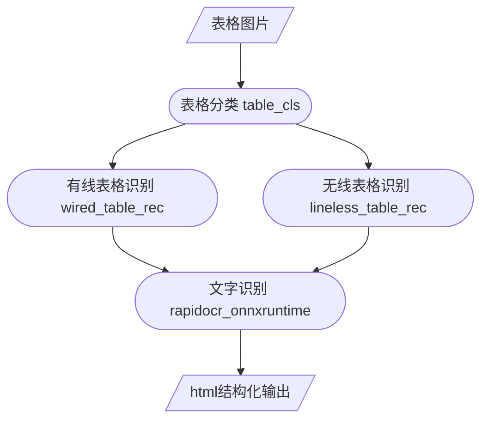

<div align="center">
  <div align="center">
    <h1><b>📊 表格结构识别</b></h1>
  </div>
  <a href="">=3.6,<3.12-aff.svg"></a>
  <a href=""></a>
<a href="https://pypi.org/project/lineless-table-rec/"></a>
<a href="https://pepy.tech/project/lineless-table-rec"></a>
<a href="https://pepy.tech/project/wired-table-rec"></a>
  <a href="https://semver.org/"></a>
  <a href="https://github.com/psf/black"></a>
  <a href="https://github.com/RapidAI/TableStructureRec/blob/c41bbd23898cb27a957ed962b0ffee3c74dfeff1/LICENSE"></a>

[English](README_en.md) | 简体中文 
</div>

### 最近更新
- **2024.11.22**
  - 支持单字符匹配方案，需要RapidOCR>=1.4.0
- **2024.12.25**
    - 补充文档扭曲矫正/去模糊/去阴影/二值化方案，可作为前置处理 [RapidUnDistort](https://github.com/Joker1212/RapidUnWrap)
- **2025.1.9**
  - RapidTable支持了 unitable 模型，精度更高支持torch推理，补充测评数据   
    
### 简介
💖该仓库是用来对文档中表格做结构化识别的推理库，包括来自阿里读光有线和无线表格识别模型，llaipython(微信)贡献的有线表格模型，网易Qanything内置表格分类模型等。\
[快速开始](#安装) [模型评测](#指标结果) [使用建议](#使用建议) [单字匹配](#单字ocr匹配) [文档扭曲修正](https://github.com/Joker1212/RapidUnWrap) [表格旋转及透视修正](#表格旋转及透视修正) [输入参数](#核心参数) [常见问题](#FAQ) [更新计划](#更新计划)
#### 特点

⚡  **快**  采用ONNXRuntime作为推理引擎，cpu下单图推理1-7s

🎯 **准**: 结合表格类型分类模型，区分有线表格，无线表格，任务更细分，精度更高

🛡️ **稳**: 不依赖任何第三方训练框架，只依赖必要基础库，避免包冲突

### 在线演示
[modelscope魔塔](https://www.modelscope.cn/studios/RapidAI/TableRec)
[huggingface](https://huggingface.co/spaces/Joker1212/TableDetAndRec)
### 效果展示

<div align="center">
    
</div>

### 指标结果

[TableRecognitionMetric 评测工具](https://github.com/SWHL/TableRecognitionMetric) [huggingface数据集](https://huggingface.co/datasets/SWHL/table_rec_test_dataset) [modelscope 数据集](https://www.modelscope.cn/datasets/jockerK/TEDS_TEST/files) [Rapid OCR](https://github.com/RapidAI/RapidOCR)

测试环境: ubuntu 20.04 python 3.10.10 opencv-python 4.10.0.84 

注:
   StructEqTable 输出为 latex，只取成功转换为html并去除样式标签后进行测评

   Surya-Tabled 使用内置ocr模块，表格模型为行列识别模型，无法识别单元格合并，导致分数较低

| 方法                                                                                                       |    TEDS     | TEDS-only-structure |
|:---------------------------------------------------------------------------------------------------------|:-----------:|:-------------------:|
| [surya-tabled(--skip-detect)](https://github.com/VikParuchuri/tabled)                                    |   0.33437   |       0.65865       |
| [surya-tabled](https://github.com/VikParuchuri/tabled)                                                   |   0.33940   |       0.67103       |
| [deepdoctection(table-transformer)](https://github.com/deepdoctection/deepdoctection?tab=readme-ov-file) |   0.59975   |       0.69918       |
| [ppstructure_table_master](https://github.com/PaddlePaddle/PaddleOCR/tree/main/ppstructure)              |   0.61606   |       0.73892       |
| [ppsturcture_table_engine](https://github.com/PaddlePaddle/PaddleOCR/tree/main/ppstructure)              |   0.67924   |       0.78653       |
| [StructEqTable](https://github.com/UniModal4Reasoning/StructEqTable-Deploy)                              |   0.67310   |       0.81210       |
| [RapidTable(SLANet)](https://github.com/RapidAI/RapidTable)                                              |   0.71654   |       0.81067       |
| table_cls + wired_table_rec v1 + lineless_table_rec                                                      |   0.75288   |       0.82574       |
| table_cls + wired_table_rec v2 + lineless_table_rec                                                      |   0.77676   |       0.84580       |
| [RapidTable(SLANet-plus)](https://github.com/RapidAI/RapidTable)                                         | 0.84481 |     0.91369     |
| [RapidTable(unitable)](https://github.com/RapidAI/RapidTable)                                         | **0.86200** |     **0.91813**     |

### 使用建议
wired_table_rec_v2(有线表格精度最高): 通用场景有线表格(论文，杂志，期刊, 收据，单据，账单)

wired_table_rec_v2 对1500px内大小的图片效果最好，所以分辨率超过2000px建议等比缩放一下

SLANet-plus/unitable (综合精度最高): 文档场景表格(论文，杂志，期刊中的表格)

### 安装

``` python {linenos=table}
pip install wired_table_rec lineless_table_rec table_cls
```

### 快速使用

``` python {linenos=table}
import os

from lineless_table_rec import LinelessTableRecognition
from lineless_table_rec.utils_table_recover import format_html, plot_rec_box_with_logic_info, plot_rec_box
from table_cls import TableCls
from wired_table_rec import WiredTableRecognition

lineless_engine = LinelessTableRecognition()
wired_engine = WiredTableRecognition()
# 默认小yolo模型(0.1s)，可切换为精度更高yolox(0.25s),更快的qanything(0.07s)模型
table_cls = TableCls() # TableCls(model_type="yolox"),TableCls(model_type="q")
img_path = f'images/img14.jpg'

cls,elasp = table_cls(img_path)
if cls == 'wired':
    table_engine = wired_engine
else:
    table_engine = lineless_engine
  
html, elasp, polygons, logic_points, ocr_res = table_engine(img_path)
print(f"elasp: {elasp}")

# 使用其他ocr模型
#ocr_engine =RapidOCR(det_model_dir="xxx/det_server_infer.onnx",rec_model_dir="xxx/rec_server_infer.onnx")
#ocr_res, _ = ocr_engine(img_path)
#html, elasp, polygons, logic_points, ocr_res = table_engine(img_path, ocr_result=ocr_res)
# output_dir = f'outputs'
# complete_html = format_html(html)
# os.makedirs(os.path.dirname(f"{output_dir}/table.html"), exist_ok=True)
# with open(f"{output_dir}/table.html", "w", encoding="utf-8") as file:
#     file.write(complete_html)
# # 可视化表格识别框 + 逻辑行列信息
# plot_rec_box_with_logic_info(
#     img_path, f"{output_dir}/table_rec_box.jpg", logic_points, polygons
# )
# # 可视化 ocr 识别框
# plot_rec_box(img_path, f"{output_dir}/ocr_box.jpg", ocr_res)
```

#### 单字ocr匹配
```python
# 将单字box转换为行识别同样的结构)
from rapidocr_onnxruntime import RapidOCR
from wired_table_rec.utils_table_recover import trans_char_ocr_res
img_path = "tests/test_files/wired/table4.jpg"
ocr_engine =RapidOCR()
ocr_res, _ = ocr_engine(img_path, return_word_box=True)
ocr_res = trans_char_ocr_res(ocr_res)
```

#### 表格旋转及透视修正
##### 1.简单背景，小角度场景
最新wiredV2模型自适应小角度旋转
```python
import cv2

img_path = f'tests/test_files/wired/squeeze_error.jpeg'
from wired_table_rec.utils import ImageOrientationCorrector

img_orientation_corrector = ImageOrientationCorrector()
img = cv2.imread(img_path)
img = img_orientation_corrector(img)
cv2.imwrite(f'img_rotated.jpg', img)
```
##### 2.复杂背景，多表格场景
需要gpu或更高精度场景，请参考项目[RapidTableDet](https://github.com/RapidAI/RapidTableDetection)
```python
pip install rapid-table-det
```
```python
import os
import cv2
from rapid_table_det.utils import img_loader, visuallize, extract_table_img
from rapid_table_det.inference import TableDetector
table_det = TableDetector()
img_path = f"tests/test_files/chip.jpg"
result, elapse = table_det(img_path)
img = img_loader(img_path)
extract_img = img.copy()
#可能有多表格
for i, res in enumerate(result):
    box = res["box"]
    lt, rt, rb, lb = res["lt"], res["rt"], res["rb"], res["lb"]
    # 带识别框和左上角方向位置
    img = visuallize(img, box, lt, rt, rb, lb)
    # 透视变换提取表格图片
    wrapped_img = extract_table_img(extract_img.copy(), lt, rt, rb, lb)
#     cv2.imwrite(f"{out_dir}/{file_name}-extract-{i}.jpg", wrapped_img)
# cv2.imwrite(f"{out_dir}/{file_name}-visualize.jpg", img)
```

### 核心参数
```python
wired_table_rec = WiredTableRecognition()
html, elasp, polygons, logic_points, ocr_res = wired_table_rec(
    img, # 图片 Union[str, np.ndarray, bytes, Path, PIL.Image.Image]
    ocr_result, # 输入rapidOCR识别结果，不传默认使用内部rapidocr模型
    version="v2", #默认使用v2线框模型，切换阿里读光模型可改为v1
    enhance_box_line=True, # 识别框切割增强(关闭避免多余切割，开启减少漏切割)，默认为True
    col_threshold=15, # 识别框左边界x坐标差值小于col_threshold的默认同列
    row_threshold=10, # 识别框上边界y坐标差值小于row_threshold的默认同行
    rotated_fix=True, # wiredV2支持，轻度旋转(-45°~45°)矫正，默认为True
    need_ocr=True, # 是否进行OCR识别, 默认为True
    rec_again=True,# 是否针对未识别到文字的表格框,进行单独截取再识别,默认为True
)
lineless_table_rec = LinelessTableRecognition()
html, elasp, polygons, logic_points, ocr_res = lineless_table_rec(
    img, # 图片 Union[str, np.ndarray, bytes, Path, PIL.Image.Image]
    ocr_result, # 输入rapidOCR识别结果，不传默认使用内部rapidocr模型
    need_ocr=True, # 是否进行OCR识别, 默认为True
    rec_again=True,# 是否针对未识别到文字的表格框,进行单独截取再识别,默认为True
)
```


## FAQ
1. **问：识别框丢失了内部文字信息**
   - 答：默认使用的rapidocr小模型，如果需要更高精度的效果，可以从 [模型列表](https://rapidai.github.io/RapidOCRDocs/model_list/#_1)
   下载更高精度的ocr模型,在执行时传入ocr_result即可, 
   - 或者尝试调节rapid_ocr的参数, 根据在线demo调节参数， [modelscope](https://www.modelscope.cn/studios/liekkas/RapidOCRDemo/summary) [huggingface](https://huggingface.co/spaces/SWHL/RapidOCRDemo)
     然后在推理时传入即可
2. **问：文档扭曲变形怎么处理？**
    - 答：使用 [RapidUnwrap](https://github.com/Joker1212/RapidUnWrap)
3. **问：模型支持 gpu 加速吗？**
    - 答：目前表格模型的推理非常快，有线表格在100ms级别，无线表格在500ms级别，
      主要耗时在ocr阶段，可以参考 [rapidocr_paddle](https://rapidai.github.io/RapidOCRDocs/install_usage/rapidocr_paddle/usage/#_3)
      加速ocr识别过程

### 更新计划

- [x] 图片小角度偏移修正方法补充
- [x] 增加数据集数量，增加更多评测对比
- [x] 补充复杂场景表格检测和提取，解决旋转和透视导致的低识别率
- [x] 优化表格分类器
- [ ] 优化无线表格模型

### 处理流程



### 致谢

[PaddleX 表格识别](https://github.com/PaddlePaddle/PaddleX/blob/release/3.0-beta1/docs/module_usage/tutorials/ocr_modules/table_structure_recognition.md)

[PaddleOCR 表格识别](https://github.com/PaddlePaddle/PaddleOCR/blob/4b17511491adcfd0f3e2970895d06814d1ce56cc/ppstructure/table/README_ch.md)

[读光-表格结构识别-有线表格](https://www.modelscope.cn/models/damo/cv_dla34_table-structure-recognition_cycle-centernet/summary)

[读光-表格结构识别-无线表格](https://www.modelscope.cn/models/damo/cv_resnet-transformer_table-structure-recognition_lore/summary)

[Qanything-RAG](https://github.com/netease-youdao/QAnything)

非常感谢 llaipython(微信，提供全套有偿高精度表格提取) 提供高精度有线表格模型。

非常感谢 [MajexH](https://github.com/MajexH)完成deepdoctection(rag-flow)的表格识别测试

### 贡献指南

欢迎提交请求。对于重大更改，请先打开issue讨论您想要改变的内容。

请确保适当更新测试。

### [赞助](https://rapidai.github.io/Knowledge-QA-LLM/docs/sponsor/)

如果您想要赞助该项目，可直接点击当前页最上面的Sponsor按钮，请写好备注(**您的Github账号名称**)，方便添加到赞助列表中。

### 开源许可证

该项目采用[Apache 2.0](https://github.com/RapidAI/TableStructureRec/blob/c41bbd23898cb27a957ed962b0ffee3c74dfeff1/LICENSE)
开源许可证。
