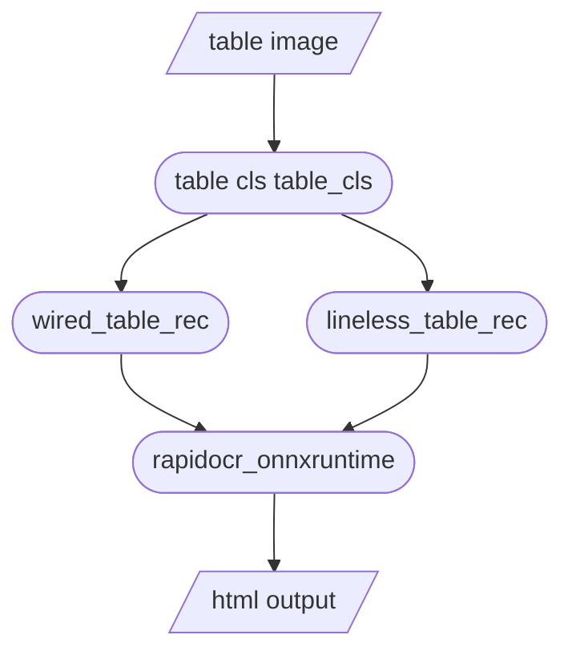

<div align="center">
  <div align="center">
    <h1><b>📊 Table Structure Recognition</b></h1>
  </div>
  <a href="">=3.6,&lt;3.12-aff.svg"></a>
  <a href=""></a>
<a href="https://pypi.org/project/lineless-table-rec/"></a>
<a href="https://pepy.tech/project/lineless-table-rec"></a>
<a href="https://pepy.tech/project/wired-table-rec"></a>
  <a href="https://semver.org/"></a>
  <a href="https://github.com/psf/black"></a>
  <a href="https://github.com/RapidAI/TableStructureRec/blob/c41bbd23898cb27a957ed962b0ffee3c74dfeff1/LICENSE"></a>
</div>

### Recent Updates
- **2024.11.16**
    - Added document distortion correction solution, which can be used as a pre-processing step [RapidUnWrap](https://github.com/Joker1212/RapidUnWrap)
- **2024.11.22**
    - Support Char Rec, RapidOCR>=1.4.0
- **2024.12.25**
    - Add document preprocessing solutions for distortion correction, deblurring, shadow removal, and binarization. [RapidUnDistort](https://github.com/Joker1212/RapidUnWrap)
### Introduction
💖 This repository serves as an inference library for structured recognition of tables within documents, including models for wired and wireless table recognition from Alibaba DulaLight, a wired table model from llaipython (WeChat), and a built-in table classification model from NetEase Qanything.

[Quick Start](#installation) [Model Evaluation](#evaluation-results) [Char Rec](#Single-Character-OCR-Matching) [Usage Recommendations](#usage-recommendations) [Document Distortion Correction](https://github.com/Joker1212/RapidUnWrap) [Table Rotation & Perspective Correction](#table-rotation-and-perspective-correction) [Input Parameters](#core-parameters) [Frequently Asked Questions](#FAQ) [Update Plan](#update-plan)
#### Features

⚡ **Fast:** Uses ONNXRuntime as the inference engine, achieving 1-7 seconds per image on CPU.

🎯 **Accurate:** Combines a table type classification model to distinguish between wired and wireless tables, providing more refined tasks and higher accuracy.

🛡️ **Stable:** Does not depend on any third-party training frameworks; relies only on essential base libraries, avoiding package conflicts.

### Online Demonstrations
[modelscope魔搭](https://www.modelscope.cn/studios/jockerK/TableRec) [huggingface](https://huggingface.co/spaces/Joker1212/TableDetAndRec)

### Effect Showcase

<div align="center">
    
</div>

### Evaluation Results

[TableRecognitionMetric Evaluation Tool](https://github.com/SWHL/TableRecognitionMetric)  
[huggingface Dataset](https://huggingface.co/datasets/SWHL/table_rec_test_dataset)  
[modelscope Dataset](https://www.modelscope.cn/datasets/jockerK/TEDS_TEST/files)  
[Rapid OCR](https://github.com/RapidAI/RapidOCR)

Test Environment: Ubuntu 20.04, Python 3.10.10, opencv-python 4.10.0.84

Note:
StructEqTable outputs in LaTeX format.测评仅选取成功转换为 HTML and stripped of style tags.

Surya-Tabled uses its built-in OCR module, which is a row-column recognition model and cannot identify cell merges, resulting in lower scores.

| Method                                                                                              |    TEDS     | TEDS-only-structure |
|:------------------------------------------------------------------------------------------------|:-----------:|:-------------------:|
| [surya-tabled(--skip-detect)](https://github.com/VikParuchuri/tabled)                           |   0.33437   |       0.65865       |
| [surya-tabled](https://github.com/VikParuchuri/tabled)                                          |   0.33940   |       0.67103       |
| [deepdoctection(table-transformer)](https://github.com/deepdoctection/deepdoctection?tab=readme-ov-file) |   0.59975   |       0.69918       |
| [ppstructure_table_master](https://github.com/PaddlePaddle/PaddleOCR/tree/main/ppstructure)     |   0.61606   |       0.73892       |
| [ppsturcture_table_engine](https://github.com/PaddlePaddle/PaddleOCR/tree/main/ppstructure)     |   0.67924   |       0.78653       |
| [StructEqTable](https://github.com/UniModal4Reasoning/StructEqTable-Deploy)                     |   0.67310   |       0.81210       |
| [RapidTable(SLANet)](https://github.com/RapidAI/RapidTable)                                     |   0.71654   |       0.81067       |
| table_cls + wired_table_rec v1 + lineless_table_rec                                             |   0.75288   |       0.82574       |
| table_cls + wired_table_rec v2 + lineless_table_rec                                             |   0.77676   |       0.84580       |
| [RapidTable(SLANet-plus)](https://github.com/RapidAI/RapidTable)                                | **0.84481** |     **0.91369**     |

### Usage Recommendations
wired_table_rec_v2 (highest precision for wired tables): General scenes for wired tables (papers, magazines, journals, receipts, invoices, bills)

paddlex-SLANet-plus (highest overall precision): Document scene tables (tables in papers, magazines, and journals)

### Installation

```python
pip install wired_table_rec lineless_table_rec table_cls
```

### Quick start

``` python {linenos=table}
import os

from lineless_table_rec import LinelessTableRecognition
from lineless_table_rec.utils_table_recover import format_html, plot_rec_box_with_logic_info, plot_rec_box
from table_cls import TableCls
from wired_table_rec import WiredTableRecognition

lineless_engine = LinelessTableRecognition()
wired_engine = WiredTableRecognition()
# Default small YOLO model (0.1s), can switch to higher precision YOLOX (0.25s), or faster QAnything (0.07s) model
table_cls = TableCls() # TableCls(model_type="yolox"),TableCls(model_type="q")
img_path = f'images/img14.jpg'

cls,elasp = table_cls(img_path)
if cls == 'wired':
    table_engine = wired_engine
else:
    table_engine = lineless_engine
  
html, elasp, polygons, logic_points, ocr_res = table_engine(img_path)
print(f"elasp: {elasp}")

# Use other OCR models
#ocr_engine =RapidOCR(det_model_dir="xxx/det_server_infer.onnx",rec_model_dir="xxx/rec_server_infer.onnx")
#ocr_res, _ = ocr_engine(img_path)
#html, elasp, polygons, logic_points, ocr_res = table_engine(img_path, ocr_result=ocr_res)  

# output_dir = f'outputs'
# complete_html = format_html(html)
# os.makedirs(os.path.dirname(f"{output_dir}/table.html"), exist_ok=True)
# with open(f"{output_dir}/table.html", "w", encoding="utf-8") as file:
#     file.write(complete_html)
# Visualize table recognition boxes + logical row and column information
# plot_rec_box_with_logic_info(
#     img_path, f"{output_dir}/table_rec_box.jpg", logic_points, polygons
# )
# Visualize OCR recognition boxes
# plot_rec_box(img_path, f"{output_dir}/ocr_box.jpg", ocr_res)
```
#### Single Character OCR Matching
```python
# Convert single character boxes to the same structure as line recognition
from rapidocr_onnxruntime import RapidOCR
from wired_table_rec.utils_table_recover import trans_char_ocr_res
img_path = "tests/test_files/wired/table4.jpg"
ocr_engine =RapidOCR()
ocr_res, _ = ocr_engine(img_path, return_word_box=True)
ocr_res = trans_char_ocr_res(ocr_res)
```

#### Table Rotation and Perspective Correction
##### 1. Simple Background, Small Angle Scene
```python
import cv2

img_path = f'tests/test_files/wired/squeeze_error.jpeg'
from wired_table_rec.utils import ImageOrientationCorrector

img_orientation_corrector = ImageOrientationCorrector()
img = cv2.imread(img_path)
img = img_orientation_corrector(img)
cv2.imwrite(f'img_rotated.jpg', img)
```
##### 2. Complex Background, Multiple Tables Scene
For GPU or higher precision scenarios, please refer to the [RapidTableDet](https://github.com/RapidAI/RapidTableDetection) project.
```python
pip install rapid-table-det
```
```python
import os
import cv2
from rapid_table_det.utils import img_loader, visuallize, extract_table_img
from rapid_table_det.inference import TableDetector
table_det = TableDetector()
img_path = f"tests/test_files/chip.jpg"
result, elapse = table_det(img_path)
img = img_loader(img_path)
extract_img = img.copy()
#There may be multiple tables
for i, res in enumerate(result):
    box = res["box"]
    lt, rt, rb, lb = res["lt"], res["rt"], res["rb"], res["lb"]
    # Recognition box and top-left corner position
    img = visuallize(img, box, lt, rt, rb, lb)
    # Perspective transformation to extract table image
    wrapped_img = extract_table_img(extract_img.copy(), lt, rt, rb, lb)
#     cv2.imwrite(f"{out_dir}/{file_name}-extract-{i}.jpg", wrapped_img)
# cv2.imwrite(f"{out_dir}/{file_name}-visualize.jpg", img)
```

### Core Parameters
```python
wired_table_rec = WiredTableRecognition()
html, elasp, polygons, logic_points, ocr_res = wired_table_rec(
    img,  # Image Union[str, np.ndarray, bytes, Path, PIL.Image.Image]
    ocr_result,  # Input rapidOCR recognition result, use internal rapidocr model by default if not provided
    version="v2",  # Default to using v2 line model, switch to AliDamo model by changing to v1
    enhance_box_line=True,  # Enhance box line find (turn off to avoid excessive cutting, turn on to reduce missed cuts), default is True
    need_ocr=True,  # Whether to perform OCR recognition, default is True
    rec_again=True,  # Whether to re-recognize table boxes without detected text by cropping them separately, default is True
)
lineless_table_rec = LinelessTableRecognition()
html, elasp, polygons, logic_points, ocr_res = lineless_table_rec(
    img,  # Image Union[str, np.ndarray, bytes, Path, PIL.Image.Image]
    ocr_result,  # Input rapidOCR recognition result, use internal rapidocr model by default if not provided
    need_ocr=True,  # Whether to perform OCR recognition, default is True
    rec_again=True,  # Whether to re-recognize table boxes without detected text by cropping them separately, default is True
)
```

## FAQ
1. **Q: The recognition box lost internal text information**
    - **A: The default small RapidOCR model is used. If you need higher precision, you can download a higher precision OCR model from the [model list](https://rapidai.github.io/RapidOCRDocs/model_list/#_1) and pass it in during execution, or try adjusting the parameters of RapidOCR according to the online demo, [modelscope](https://www.modelscope.cn/studios/liekkas/RapidOCRDemo/summary) [huggingface](https://huggingface.co/spaces/SWHL/RapidOCRDemo)
2. **Q: Does the model support GPU acceleration?**
    - **A: Currently, the inference of the table model is very fast, with wired tables at the 100ms level and wireless tables at the 500ms level. The main time consumption is in the OCR stage. You can refer to [rapidocr_paddle](https://rapidai.github.io/RapidOCRDocs/install_usage/rapidocr_paddle/usage/#_3) to accelerate the OCR recognition process.

### Update Plan

- [x] Add methods for correcting small-angle image offsets
- [x] Increase dataset size and add more evaluation comparisons
- [x] Add complex scene table detection and extraction to solve low recognition rates caused by rotation and perspective
- [x] Optimize the table classifier
- [ ] Optimize the wireless table model

### Processing Workflow



### Acknowledgments


[PaddleX Table Recognition](https://github.com/PaddlePaddle/PaddleX/blob/release/3.0-beta1/docs/module_usage/tutorials/ocr_modules/table_structure_recognition.md)

[PaddleOCR Table Recognition](https://github.com/PaddlePaddle/PaddleOCR/blob/4b17511491adcfd0f3e2970895d06814d1ce56cc/ppstructure/table/README_ch.md)

[Damo Academy - Table Structure Recognition - Wired Table](https://www.modelscope.cn/models/damo/cv_dla34_table-structure-recognition_cycle-centernet/summary)

[Damo Academy - Table Structure Recognition - Wireless Table](https://www.modelscope.cn/models/damo/cv_resnet-transformer_table-structure-recognition_lore/summary)

[Qanything-RAG](https://github.com/netease-youdao/QAnything)

Special thanks to llaipython (WeChat, providing a full suite of high-precision table extraction services) for providing the high-precision wired table model.

Special thanks to [MajexH](https://github.com/MajexH) for completing the table recognition test using deepdoctection (rag-flow).

### Contribution Guidelines

Pull requests are welcome. For major changes, please open an issue first to discuss what you would like to change.

Please ensure appropriate updates to tests.

### [Sponsor](https://rapidai.github.io/Knowledge-QA-LLM/docs/sponsor/)

If you want to sponsor this project, you can directly click the Sponsor button at the top of the current page. Please write a note (**Your Github account name**) to facilitate adding to the sponsor list.

### Open Source License

This project is licensed under the [Apache 2.0](https://github.com/RapidAI/TableStructureRec/blob/c41bbd23898cb27a957ed962b0ffee3c74dfeff1/LICENSE) open source license.
